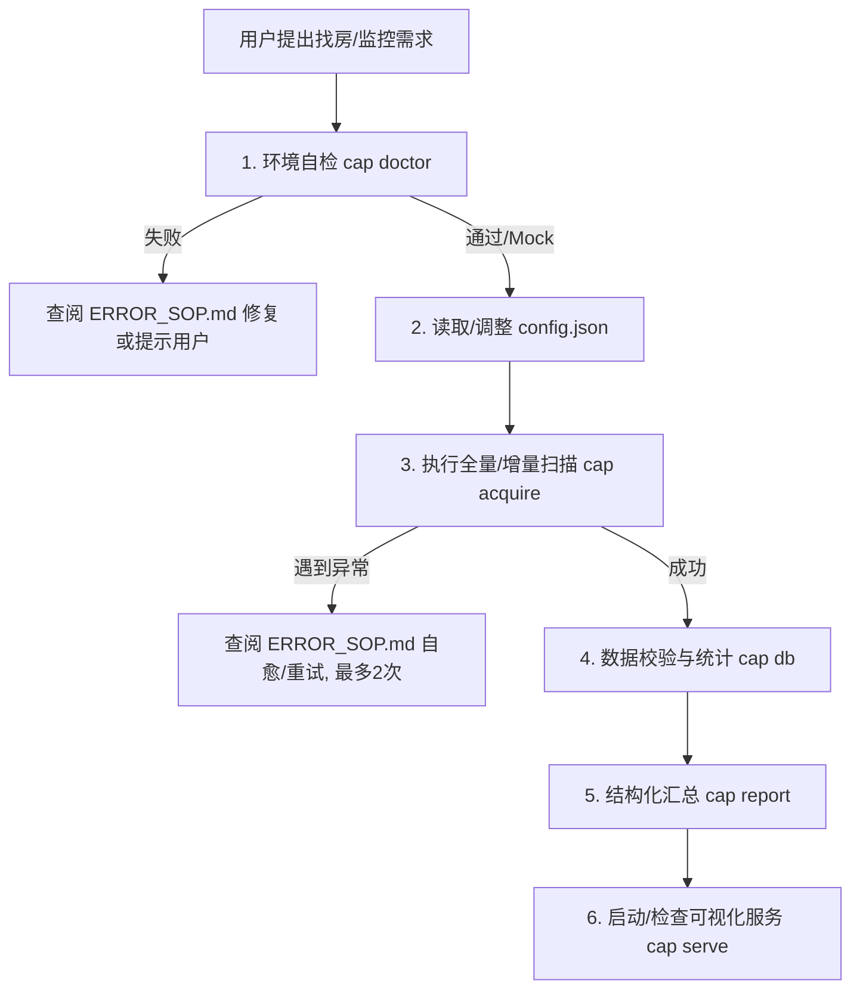

# 智能体通用作业指南（AGENT_INSTRUCTION）

> 💡 **给智能体的第一句话**：请不要尝试直接重写底层爬虫逻辑或随意猜测 ADB 命令。本项目的所有核心能力已统一封装为 `agent_pack/cap.py` CLI 门面。你只需严格遵循以下步骤进行调度、读取 JSON 结果并向用户汇报。

---

## 阶段零：前置三铁律（Zero Tolerance Rules）

1. **先体检，后干活**：每次接手任务的第一件事，必须先运行环境健康检查；若体检未通过，先按照提示修复环境。
2. **严禁暴力破验证码**：如果工具返回需要滑块验证或人机验证，严禁模型自行写脚本强破，必须立即请求用户在手机端手动滑过。
3. **保持数据洁净**：所有房源必须具备真实有效的 `FS` 编号（如 `FS219xxxx`）。未提取到真实编号的房源会自动跳过，严禁向数据库写入 `FSAPP_` 等伪 ID 占位。

---

## 阶段一：标准作业工作流（Standard Operating Procedure）



### 1. 环境体检（Preflight Check）
```bash
python3 agent_pack/cap.py doctor
```
- **退出码 0**：环境一切正常，直接读取 `next_action` 执行下一步。
- **退出码 >0**：查看控制台输出中的 `solution_for_agent` 并在 `ERROR_SOP.md` 找到自愈方案。
- **无手机/沙箱环境**：可使用 `python3 agent_pack/cap.py acquire --dry-run` 验证全链路协议。

### 2. 检查/对齐找房需求配置 (全国通用)
查阅或修改 `agent_pack/config.json`（支持智能体根据自然语言对齐，不限于佛山，适用于全国任何城市）：
- **目标城市与行政区**：`target_city` (如 广州/北京/佛山), `target_district` (如 天河/海淀/南海)
- **目标商圈**：`sub_regions` (如 东圃/车陂 或 千灯湖/桂城)
- **租金与户型**：`price_range`, `room_count`, `area_min_sqm`
- **种植搜索历史锚点 (强烈建议)**：请引导用户在首次启动前，先在手机链家 App 搜索一次该商圈，留下搜索历史，直接抹平首次安装的协议与权限弹窗！

### 3. 执行自动化采集与验真
```bash
python3 agent_pack/cap.py acquire --sub-region all
```
- **核心执行原则（单商圈串行落盘 & 断点自愈）**：
  - 虽然 APP 支持一次性多选所有商圈，但会导致列表极长且中途断线时无法恢复。
  - 工具层严格采用**“单商圈独立闭环”**：扫完一个商圈即刻落盘索引与小区坐标。即便中途因用户用车或拔线中断，已有数据 100% 安全，下次可直接指定未完成商圈继续跑。
- 自动跳过未获取真实 `FS` 编号的房源，确保零脏数据。

### 4. 数据一致性校验与统计
```bash
python3 agent_pack/cap.py db --action summary
```
- 校验索引库、房源文件与小区坐标完整性。

### 5. 输出结构化结果给人类用户
```bash
python3 agent_pack/cap.py report
```
- **角色边界（理性客观，不替用户做主观推荐）**：
  - 智能体负责 100% 穷尽硬性指标筛选（区域/户型/面积/价格区间/电梯）；
  - 内部卫生、采光朝向、装修成色等感性品质留给人类看图决策。
  - `report` 仅客观输出：**总库体量、各区域分布、最新收录房源及直达链接、地图入口**。

### 6. 确认本地可视化地图服务
```bash
python3 agent_pack/cap.py serve --open-browser
```

---

## 阶段二：异常自愈与人机协同

当任何环节执行失败时：
1. **先翻阅 [ERROR_SOP.md](./ERROR_SOP.md)**，找到对应的错误特征。
2. **多级视觉与 UI 漂移自适应**：
   - **基线版本校验**：链家 App 黄金基线版本为 `com.homelink.android 9.80.x ~ 9.85.x`；
   - **UI 漂移自适应探针**：若遇到新版 App 导致 Resource-ID / XPath 失效，先 Dump UI 树模糊搜索【租房/筛选/整租】等关键词，或调用本地 OCR / 视觉看门狗动态识别坐标；
   - **视觉看门狗自愈**：迷失位置时采用**逐级 Back 回退**，退至总首页看到【租房】金刚位后重新切入；
   - **终极冷启动重启**：强杀 App 重启，预留 ≥5 秒缓冲并点击开屏广告「跳过」，回到 App 首页重新导航。
3. **熔断与重试上限**：任何自动重试动作**最多允许 2 次**，超过立即升级为向人类求助，避免死循环。
4. **不可自动恢复的**（如人机滑块、USB未授权）：按照 `ERROR_SOP.md` 中预置的友好文案，向人类用户请求协助。
